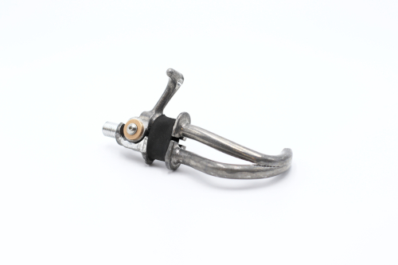

# Work Hook

Rock solid, functional, easy to use and maintain, this cable-operated Work Hook makes manual work possible for upper-limb amputees under all conditions.

## WARNING NOTICE BEFORE STARTING

The versions of our solutions reproduced in Do It Yourself do not have the CE marking. It can only be apply to solutions developed and sold by ORTHOPUS which follow the regulations in force.
ORTHOPUS cannot guarantee the “quality” of solutions replicated by third parties thanks to documentation shared on github.

### D.I.Y LEVEL **⭐⭐⭐⭐⭐**

**Required components:** To make your own Work Hook, you will need ....

## CONTRIBUTION

Your contribution to these projects is welcome!

* Have you discovered a bug or you have an improvement ideas ?

  * Go to the GitHub [issues](https://github.com/orthopus/01-WorkHook/issues) of the project.

* You have time, some Maker skills and you want to help us ?

  * If you need to make some modifications, our Fusion 360 source files are available on request, don’t hesitate to ask us!

  * Read the [CONTRIBUTING](CONTRIBUTING.md) file to help us to upgrade this project

  * Read the [CODEOFCONDUCT](CODEOFCONDUCT.md) file to know community standards

    

## CONTACT

If you wish to contact us, you can send a message to contact@orthopus.com