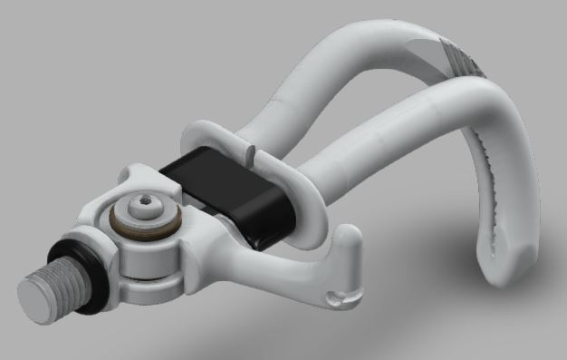

# Work Hook

Rock solid, functional, easy to use and maintain, this cable-operated Work Hook makes manual work possible for upper-limb amputees under all conditions.

## WARNING NOTICE BEFORE STARTING

The Do It Yourself (DIY) versions of our solutions are not CE marked. CE marking is only applicable to solutions developed and sold by ORTHOPUS because their design follows the current regulations. ORTHOPUS cannot guarantee the “quality” of solutions replicated by third parties thanks to the documentation shared on github.

### D.I.Y LEVEL **⭐⭐⭐⭐⭐**

**WARNING:** Making a DIY version of the hook can be quite complex and dangerous. These are the reasons why ORTHOPUS will not be sharing a MAKING MANUAL for the Work Hook here. But if you feel comfortable with the making process, please don't hesitate to ask us for the files.

However we share the 3D models of the different hook configurations and they can be found on the Work Hook repository [here](/src) with the corresponding [mechanical drawings](/src/DRW-0112-1xxx-WorkHook.pdf).

🧐 *Tip : open the image in a new tab to view the Work Hook in Fusion 360 viewer*

### **List of parts**

On the following picture, you can find an exploded view showing all the parts of the Work Hook. In the table, links allow you to find where components can be purchased or, for the casted ones, where we are manufacturing them. You can download the ***Bill of Material stored [here](https://github.com/orthopus/01-WorkHook/blob/main/src/BOM-0112-BoM%20Work%20Hook.pdf) to get clickable links.***

To get the best experiences with the Universal Wrist, full product details are provided in the [INSTRUCTIONS FOR USE](https://orthopus.com/wp-content/uploads/2021/06/IFU-OR-0112-Work-Hook-ORTHOPUS-Instructions-For-Use.pdf).

## CONTRIBUTION

Your contribution to these projects is welcome!

* Have you discovered a bug or you have an improvement ideas ?

  * Go to the GitHub [issues](https://github.com/orthopus/01-WorkHook/issues) of the project.

* You have time, some Maker skills and you want to help us ?

  * If you need to make some modifications, our Fusion 360 source files are available on request, don’t hesitate to ask us!

  * Read the [CONTRIBUTING](CONTRIBUTING.md) file to help us to upgrade this project

  * Read the [CODEOFCONDUCT](CODEOFCONDUCT.md) file to know community standards

    

## CONTACT

If you wish to contact us, you can send a message to contact@orthopus.com
